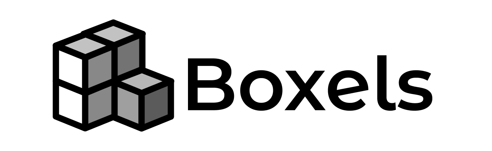

# Boxels

[](https://www.npmjs.com/package/boxels)
[](./LICENSE)
[](https://github.com/kokkotero/boxels/actions)
[](https://github.com/kkokotero/boxels)

`Boxels` es una librería frontend diseñada para desarrollar aplicaciones web modernas del lado del cliente.  
Está construida con `TypeScript` y enfocada en **bajo consumo**, **control total** y **excelente experiencia de desarrollo**.

Incluye un sistema reactivo propio, un motor optimizado de ciclo de vida y renderizado para **Single Page Applications (SPA)**, y una versión personalizada de `JSX` sin dependencias externas.

> ⚠️ Actualmente `Boxels` no soporta renderizado del lado del servidor (SSR).   Esta funcionalidad está en evaluación para futuras versiones.

> 📄 La documentación detallada y técnica de cada módulo se encuentra en la carpeta [`./docs/**`](./docs).  

> Este proyecto cuenta con un [Código de Conducta](./CODE_OF_CONDUCT.md). Por favor, revísalo antes de contribuir.

Aquí tienes el fragmento que puedes insertar justo después de la sección principal y antes de la tabla de contenidos. Este mensaje explica que existe una **CLI oficial** (`box`) para facilitar el uso de Boxels:

---

### CLI Oficial Disponible

Para mejorar la experiencia de desarrollo con Boxels, puedes usar la [**CLI oficial**](https://www.npmjs.com/package/boxels-config) con el comando `box`.

Te permite:

- Crear nuevos proyectos Boxels
- Servir y compilar tu aplicación con Vite
- Ejecutar pruebas con entorno DOM incluido
- Usar configuraciones simplificadas para producción y desarrollo

```bash
npm install -g boxels-config
````

> Una vez instalada, puedes ejecutar `box --help` para ver los comandos disponibles.

---

### Soporte Multiplataforma

Boxels incluye soporte para desarrollar aplicaciones multiplataforma mediante un módulo especial ubicado en [`boxels/multiplatform`](./src/multiplatform).

Este módulo proporciona wrappers y extensiones para funcionalidades nativas en:

* **Web**
* **Ionic (Capacitor)**
* **Electron**

Todas las plataformas comparten la misma semántica y API base. El sistema selecciona automáticamente la implementación adecuada en tiempo de ejecución.

Algunas funcionalidades incluidas:

* Acceso a cámara (`useCamera`)
* Almacenamiento clave-valor (`store`)
* Cliente HTTP con cancelación y transformaciones (`httpClient`)
* Notificaciones nativas (`notifier`)

> El módulo `multiplatform` está diseñado para ser extensible y respetar la filosofía de bajo acoplamiento de Boxels.


## Tabla de Contenidos

* [Instalación](#instalación)
* [Características](#características)
* [Inicio Rápido](#inicio-rápido)
* [Cómo Contribuir](#cómo-contribuir)
* [Colaboradores](#colaboradores)
* [Licencia](#licencia)

---

## Instalación

Instala Boxels usando npm:

```bash
npm install boxels
```

> Requiere Node.js v18 o superior.

---

## Características

* JSX personalizado sin dependencias externas.
* Sistema reactivo integrado: `signal`, `computed`, `effect`, `persistentSignal`.
* Componentes base: `<Show>`, `<For>`, `<Lazy>`, `<RouterOutlet>`.
* Manejo de formularios con validación reactiva.
* Enrutador integrado con manejo de rutas, estado e historial.
* Ciclo de vida declarativo: `$lifecycle:mount`, `$lifecycle:unmount`, etc.
* Comunicación entre componentes mediante canales reactivos.
* Utilidades modernas: manejo de estilos, almacenamiento persistente, cliente HTTP con cancelación, entre otras.
* Cero dependencias externas innecesarias.

---

## Inicio Rápido

```tsx
import { mount } from 'boxels';

const App = () => (
    <main>
        <h1>Hola desde Boxels 👋</h1>
    </main>
);

mount(document.body, App());
```

---

## Cómo Contribuir

¿Tienes ideas, mejoras o encontraste un bug? ¡Tu ayuda es bienvenida!
Sigue estos pasos para contribuir:

1. Revisa los [issues](https://github.com/kkokotero/boxels/issues) abiertos.
2. Haz un fork del repositorio.
3. Crea una rama con tu cambio:

   ```bash
   git checkout -b feature/mi-cambio
   ```
4. Realiza tus cambios y haz commit:

   ```bash
   git commit -m "feat: agrega nueva funcionalidad"
   ```
5. Haz push y abre un **Pull Request**.

Consulta la [guía de contribución](./CONTRIBUTING.md) para más detalles.

---

## Colaboradores

Agradecemos a todas las personas que han contribuido a Boxels:

<table>
  <tr>
    <td align="center">
      <a href="https://github.com/kkokotero">
        
        <br />
        <sub><b>kkokotero</b></sub>
      </a>
    </td>
  </tr>
</table>

¿Quieres aparecer aquí? ¡Envía tu PR!

---

## Licencia

Este proyecto está licenciado bajo la [MIT License](./LICENSE.txt).

