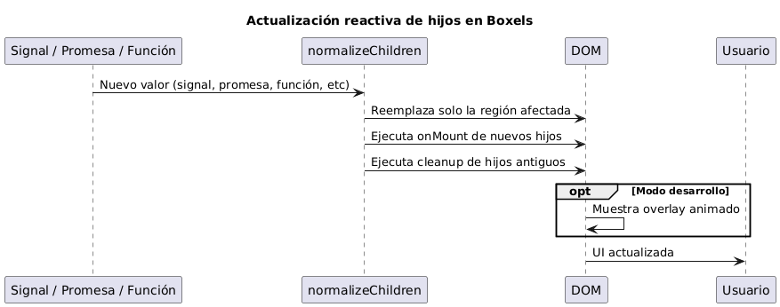
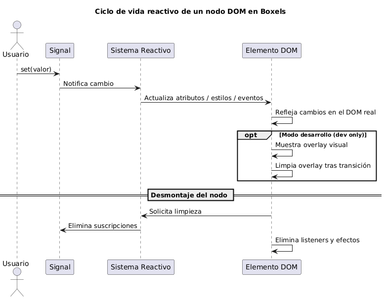

# Documentación técnica de `dom`

Este documento describe la arquitectura, ciclo de vida, manejo de la reactividad y aspectos técnicos del módulo `src/dom` del proyecto Boxels.

## Estructura del módulo

El directorio `src/dom` está organizado de la siguiente manera:

- `index.ts`: Punto de entrada principal del módulo DOM.
- `attributes/`: Manejo de atributos y lógica relacionada.
  - `index.ts`: Exporta utilidades de atributos.
  - `elements/`: Lógica específica para atributos de elementos.
  - `handlers/`: Manejadores de eventos y lógica de interacción.
    - `form-handlers.ts`: Manejadores para formularios.
    - `gesture-handlers.ts`: Manejadores de gestos.
    - `global-handlers.ts`: Manejadores globales.
    - `index.ts`: Exporta todos los handlers.
    - `interaction-handlers.ts`: Manejadores de interacción.
    - `interface-handlers.ts`: Manejadores de interfaz.
  - `styles/`: Manejo de estilos.
    - `class.ts`: Utilidades para clases CSS.
    - `index.ts`: Exporta utilidades de estilos.
    - `style.ts`: Utilidades para estilos en línea.

## Ciclo de vida de los elementos DOM

El módulo `src/dom` abstrae el ciclo de vida de los elementos DOM para integrarse con el sistema reactivo de Boxels. Los puntos clave son:

1. **Creación**: Los elementos se crean a través de funciones utilitarias que pueden recibir señales reactivas como propiedades.
2. **Montaje**: Al montar un elemento, se asocian los atributos, estilos y eventos definidos, y se suscriben a señales reactivas si es necesario.
3. **Actualización**: Cuando una señal reactiva cambia, los atributos, estilos o eventos asociados se actualizan automáticamente en el DOM.
4. **Desmontaje**: Al desmontar un elemento, se limpian las suscripciones y manejadores para evitar fugas de memoria.

## Reactividad

El módulo DOM está profundamente integrado con el sistema reactivo de Boxels (`src/core/reactive`). Sin embargo, el manejo reactivo de hijos y nodos es único y mucho más granular que en otros frameworks:

- **Hijos reactivos**: Los hijos de cualquier elemento pueden ser señales, promesas, funciones, fragmentos, arrays, nodos o valores primitivos. El sistema detecta automáticamente el tipo y los normaliza usando `normalizeChildren`.
- **Actualización incremental**: Cuando una señal usada como hijo cambia, Boxels reemplaza solo la región afectada del DOM usando comentarios como delimitadores y `DocumentFragment`, sin volver a renderizar todo el árbol.
- **Promesas y funciones**: Si un hijo es una promesa, se muestra un placeholder y se reemplaza cuando la promesa se resuelve. Si es una función, se ejecuta y se normaliza el resultado.
- **Limpieza y ciclo de vida**: Cada hijo normalizado puede registrar funciones de montaje (`onMount`) y limpieza (`cleanup`), que se ejecutan en el orden correcto para evitar fugas y efectos colaterales.
- **Overlays visuales**: En modo desarrollo, los cambios reactivos en hijos pueden mostrar overlays animados sobre los nodos afectados para depuración visual.

### Ejemplo avanzado de hijos reactivos

```tsx
import { signal } from "boxels/core";

export function AsyncDemo() {
  const mensaje = signal("Cargando...");
  const datos = signal<Promise<string>>(fetch("/api/texto").then((r) => r.text()));

  return (
    <section>
      <button $on:click={() => mensaje.set("¡Actualizado!")}>Actualizar mensaje</button>
      <div>{mensaje}</div> {/* Se actualiza automáticamente */}
      <div>{datos}</div> {/* Muestra placeholder y luego el texto cuando la promesa se resuelve */}
      <div>{() => Math.random()}</div> {/* Función como hijo, se evalúa y normaliza */}
    </section>
  );
}
```

---

## Diagrama: Flujo de actualización de hijos reactivos



---

## Manejadores y utilidades

- **Handlers**: El subdirectorio `handlers/` contiene lógica para manejar eventos de formularios, gestos, interacciones y eventos globales. Estos handlers pueden trabajar con señales para mantener la UI sincronizada con el estado de la aplicación.
- **Atributos y estilos**: El subdirectorio `attributes/` y `styles/` proveen utilidades para manipular atributos y estilos de manera declarativa y reactiva.

## Integración con otros módulos

- **Reactividad**: Se apoya en el sistema de señales y efectos de `src/core/reactive`.
- **Componentes**: Es utilizado por los componentes de `src/components` para renderizar y actualizar el DOM de manera eficiente.

## Ejemplo de uso

```ts
import { setAttribute } from "boxels/dom";
import { signal } from "boxels/core";

const count = signal(0);
const el = document.createElement("div");
const cleanUp = setAttribute(el, "data-count", count);
// Cuando count cambia, el atributo data-count se actualiza automáticamente
```

```ts
import { $ } from "boxels/dom";
import { signal } from "boxels/core";

const count = signal(0);
const el = $('div', {}, count);

el.mount(document.body);
```

### Ejemplo en JSX (Boxels Runtime)

```tsx
import { signal } from "boxels/core";

export const Counter: JSX.Component<'div'> = ({ ...props }) => {
  const count = signal(0);

  return <div {...props}>{count}</div>;
};
// El contenido se actualizan automáticamente cuando cambia count
```

---

## Diagrama de ciclo de vida reactivo




---

## Overlays visuales de cambio (modo desarrollo)

Cuando una señal reactiva provoca un cambio en el DOM, Boxels puede mostrar un overlay visual animado sobre el nodo afectado (si está activado el modo desarrollo y la opción de mostrar cambios). Esto ayuda a depurar y visualizar qué partes de la UI se están actualizando.

El overlay se implementa inyectando un `<div>` absolutamente posicionado sobre el nodo modificado, con una animación de opacidad. El sistema detecta si el nodo es texto, elemento o fragmento, y ajusta el overlay para cubrir exactamente la región afectada.

---

## Integración con JSX y runtime

Boxels provee un runtime JSX propio, donde la función `$` de `src/dom` es utilizada como `jsx`, `jsxs` y `jsxDEV` en el runtime (`src/runtime/jsx-runtime.ts`). Esto permite escribir componentes declarativos y reactivos, pero con una sintaxis de atributos y eventos específica:

```tsx
import { signal } from "boxels/core";
import { Show } from "boxels/components";

export function Demo() {
  const visible = signal(true);
  const count = signal(0);

  return (
    <section>
      <button $on:click={() => count.update((v) => v + 1)} $lifecycle:mount={() => console.log("Botón montado")} class={{ active: visible, "btn-primary": true }} style={{ color: visible.map((v) => (v ? "green" : "gray")), fontWeight: "bold" }}>
        Incrementar ({count})
      </button>
      <button $on:click={() => visible.update((v) => !v)}>Toggle visible</button>
      <Show when={visible}>
        <div $lifecycle:mount={() => console.log("Visible!")}>¡Visible!</div>
      </Show>
    </section>
  );
}
```

**Notas sobre la sintaxis JSX de Boxels:**

- Los eventos DOM se declaran como `$on:evento` (ej: `$on:click`).
- Los eventos de ciclo de vida se declaran como `$lifecycle:mount` y `$lifecycle:destroy`.
- Los atributos `class` y `style` aceptan objetos, señales, funciones y mapas reactivos.
- Los hijos (`children`) pueden ser señales, arrays, promesas o cualquier valor renderizable.
- Todos los atributos pueden ser señales reactivas y se actualizarán automáticamente.

El runtime traduce el JSX a llamadas a `$`, que maneja el ciclo de vida, la reactividad, overlays visuales y la limpieza automáticamente.

## Resumen

El módulo `src/dom` proporciona una capa declarativa y reactiva para manipular el DOM, integrando atributos, estilos y eventos con el sistema de señales de Boxels. Esto permite construir interfaces de usuario altamente dinámicas y eficientes, manteniendo el código limpio y fácil de mantener.
