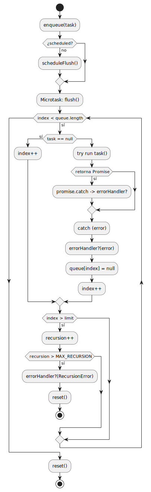

# Microtask Scheduler en Boxels

Este documento describe un **microtask scheduler** implementado como un IIFE que gestiona una **cola de tareas** (sincrónicas o asíncronas) y las ejecuta en el siguiente turno de microtareas (usando `queueMicrotask` o `Promise.then` como *fallback*).
La implementación incluye protecciones contra recursión infinita, cancelación de tareas pendientes y manejo centralizado de errores.

---

## Resumen

**Objetivo principal:**
Ejecutar funciones (sincrónicas o que retornen promesas) de forma diferida en el siguiente ciclo de microtareas, agrupando ejecuciones para mejorar el rendimiento y evitar ráfagas.

**Características clave:**

* **Agrupación de tareas**: Reduce el número de microtareas programadas.
* **Protección contra loops infinitos**: Límite `MAX_RECURSION`.
* **Cancelación**: Posibilidad de anular tareas aún no ejecutadas.
* **Manejo global de errores**: Con `onSchedulerError(handler)`.

---

## Tipos y estado interno

```ts
export type Task = () => void | Promise<void>;

export interface SchedulerState {
  queue: (Task | null)[];
  index: number;
  scheduled: boolean;
  flushing: boolean;
  recursion: number;
}

const MAX_RECURSION = 10000;
```

**Descripción de campos:**

* **queue**: Cola FIFO de tareas; las canceladas se marcan como `null`.
* **index**: Índice de la próxima tarea a ejecutar.
* **scheduled**: Indica si hay un `flush` programado.
* **flushing**: Marca si el `flush` está en ejecución.
* **recursion**: Contador para detectar crecimientos excesivos de la cola durante el `flush`.

---

## Diagrama de flujo general 




---

## Diagrama de secuencia — ejecución de tarea asíncrona


---

## Ciclo de vida de ejecución

1. **Encolado**
   `enqueue(task)` añade la tarea a `queue`. Si no hay `flush` programado, lo agenda.
2. **Programación**
   `scheduleFlush()` intenta `queueMicrotask(flush)`; si no, `Promise.resolve().then(flush)`.
3. **Ejecución (`flush`)**

   * Marca `scheduled = false` y `flushing = true`.
   * Itera la cola, ejecutando tareas válidas.
   * Maneja errores y promesas con `catch` centralizado.
   * Controla el crecimiento de la cola con `recursion` y `MAX_RECURSION`.
4. **Reset**
   Limpia estado interno tras completar o ante error crítico.

---

## API pública

```ts
export const queue = microtaskScheduler.enqueue;
export const cancel = microtaskScheduler.cancel;
export const onSchedulerError = microtaskScheduler.setErrorHandler;
export const __internalScheduler = microtaskScheduler._internal;
```

---

## Ejemplos de uso

**Encolar tarea sincrónica**

```ts
queue(() => {
  console.log("Hola desde microtask");
});
```

**Encolar tarea asíncrona**

```ts
queue(async () => {
  await apiCall();
  console.log("Resultado obtenido");
});
```

**Cancelar una tarea antes de ejecución**

```ts
const t = () => console.log("No debería ejecutarse");
queue(t);
cancel(t);
```

**Registrar manejador de errores**

```ts
onSchedulerError((err) => {
  console.error("Error en scheduler:", err);
});
```

---

## Consideraciones adicionales

* **Uso interno en Boxels:** El scheduler se integra con subsistemas reactivos y de renderizado para minimizar operaciones costosas.
* **Escenarios recomendados:** Acumulación de tareas ligeras que pueden esperar al siguiente microtask, evitando bloquear el *main thread*.
* **Limitaciones:** No garantiza orden exacto si hay cancelaciones; las tareas canceladas no se eliminan físicamente para evitar realineamientos costosos en la cola.